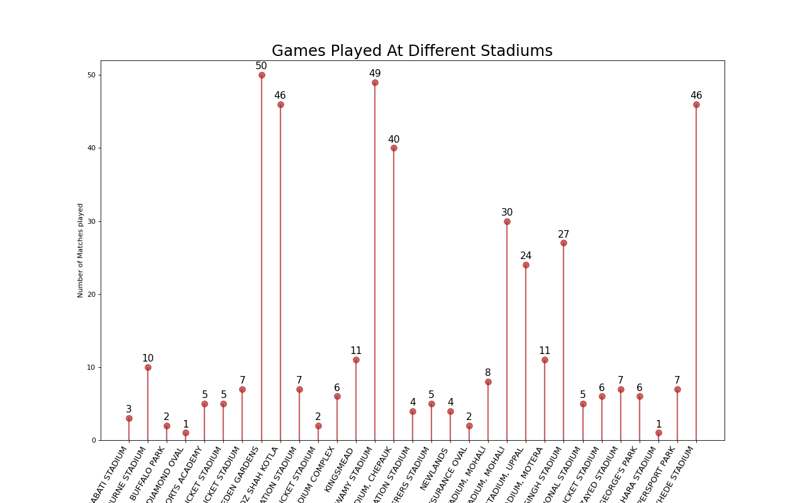
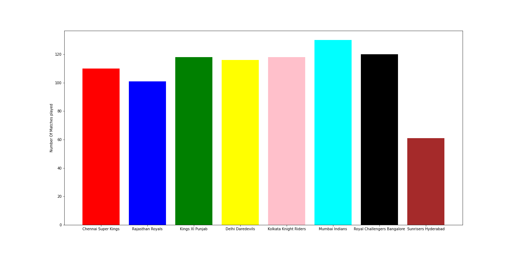

# IPL SCORE PREDICTION

     

Predicting The Score of IPL Teams With the Necessary Parameters 

## Understanding Requirement

Here we need to Bulid Machine Learning model such that our model will predict the score of Batting Team or First Innings Score  

 ## Data Agoisition && Data Preparation
 
 **Data Agoisition**
 
 First we need Data to Our Model To Train.Here Fortunately Our[`DataSet`](https://www.kaggle.com/dineshchandthakur/ipl-dataset) is Present in Kaggle
 
 **IPL DATSET Consists of all the matches(per bowl) which are played between 2013-2018**
 
 **Data Prepration**
 
 Here in our Dataset 
 
 
 - Number of Data Points=76014
 
 - Number of Features =11
 
 - Number of Missing Values=0
 
 - Number of Duplicates=0
 
 **FEATURES**
 
 |__FEATURES__|__Description__|__Type__|
 |-|-|-|
|__mid__|__Every Unique Match has Unique Mid__|__Int__|
|__date__|__Date of Match__|__Date__|
|__venue__|__Venue of Match__|__Categorical Data__|
|__bat_team__|__Batting Team of Match__|__Categorical Data__|
|__bowl_team__|__Bowling Team of Match__|__Categorical Data__|
|__runs__|__Runs Scored until the Present Ball of Over__|__Int__|
|__wickets__|__Wickets Lost on the Present Ball of Over__|__Int(<=10)__|
|__overs__|__Present Ball of Over__|__Float(0.1-19.6)__|
|__runs_last_5__|__Runs Scored in Last Five Overs Until Present Ball of Over__|__Int__|
|__wickets_last_5__|__Wickets Lost in Last Five Overs Until Present Ball of Over__|__Int(<=10)__|
|__total__|__Total Runs Scored in the Match__|__Float(0.1-19.6)__|

Here mid is not needed 

|__DEPENDENT or INPUT FEATURES__|__date,venue,bat_team,bowl_team,bowl_team,runs,wickets,overs,runs_last_5,wickets_last_5__|
|-|-|
|__INDEPENDENT FEATURES__|__total__|

 
 
 **ASSUMPTATIONS**
 
 1)Here since the  Features like runs_last_5 and wickets_last_5 will have value only if the overs >=5.0 .so lets us assume are going to predict score only when atleast 5
 overs are completed in the Match.so remove records where overs<5.0
 
 2)Currently Dataset contains
 -Number of Teams=13
 -Number of Venue's=35
 
 |__Teams__|
 |-|
|__Deccan Chargers__|
|__Kings XI Punjab__|
|__Rajasthan Royals__|
|__Kochi Tuskers Kerala__|
|__Pune Warriors__|
|__Sunrisers Hyderabad__|
|__Rising Pune Supergiants__|
|__Gujarat Lions__|
|__Mumbai Indians__|
|__Royal Challengers Bangalore__|
|__Chennai Super Kings__|
|__Delhi Daredevils__|
|__Kolkata Knight Riders__|
 
 But currently Deccan Chargers,Rising Pune Supergiant,Gujarat Lions and Kochi Tuskers Kerala  teams are not present in the ipl so let us remove records which contains these teams.During this process some venues which are home to these team are also being removed.So we are left with
 
 * Number of Teams=8
 * Number of Venue's=31
 * Number of Matches=437
 
 
 Here Also Convert Categorical features to Numberical By One Hot Encoding
 
 - Venue= One Hot Encoded List of Size 31
 
 - Bowling team=One Hot Encoded List of Size 8
 
 - Batting team=One Hot Encoded List of Size 8
 
 
 
 
 
 
 
 
 ## Exploratory Data Analysis
 
 Here we want to mainly Analyse Two Things
 
 1)**Number of Games Played in Each Venue**
 
 
 
 2)**Number of Games Played by Each Team**
 
  
 
 
 ## Modeling
 
 Here all the independent and Dependent features are ready.These features are also preprocessed.Now we need to Choose a Model
 
 This is a Regression Problem.Also Data is not Very Large hence we are restricting ourself to only **MACHINE LEARNING** and not **DEEP LEARNING**
 
 In Machine Learning for Regression
 
 - **Linear Models**
   - Linear Regression
 
   - Ridge Regression
   
   - Lasso Regression
   
 
 - **Non Linear Models**
 
   - Decision Tree
   
   - Random Forest
   
   - Gradient Boost Decision Trees 
 
**So by applying all these algorithms to the given data set.All these algorithms contains some Hyperparameters which need to initialized of some values and they can be any values and these values influence our Model performance (OVER-FIT OR BEST-FIT OR UNDER-FIT). so we need find best Hyperparmeters and they are found using GRIDSEARCH**

 
